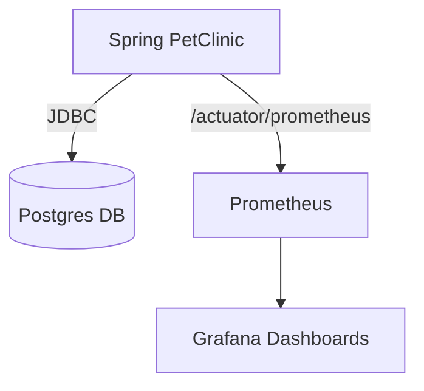
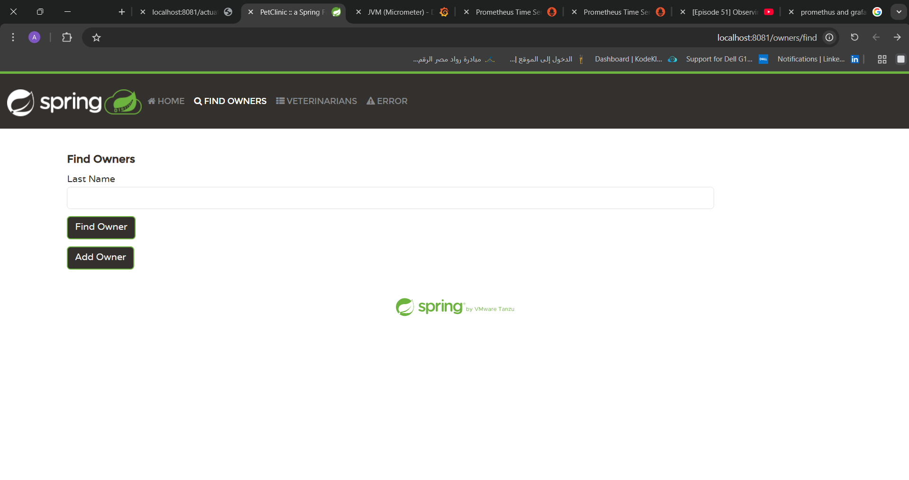
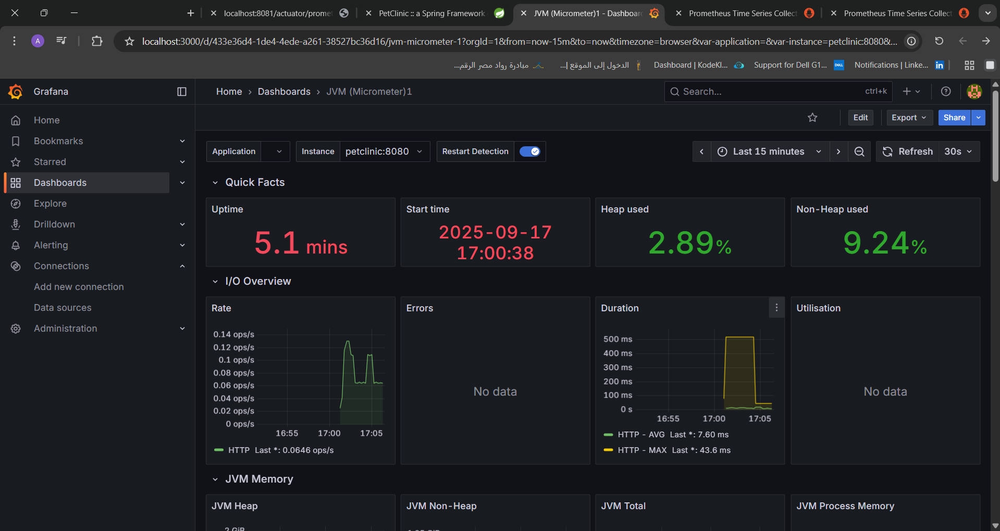
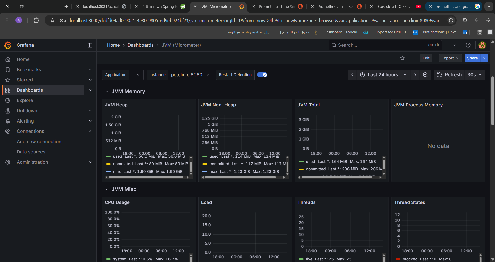
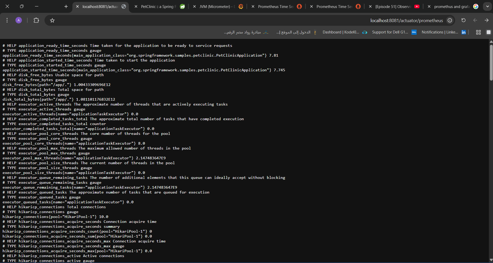
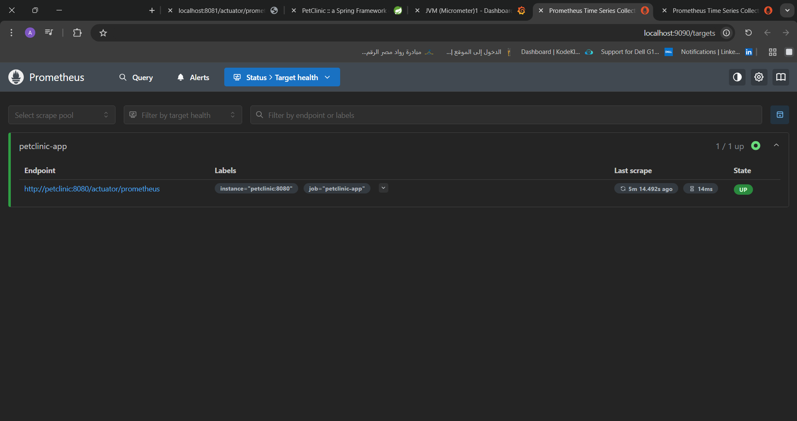
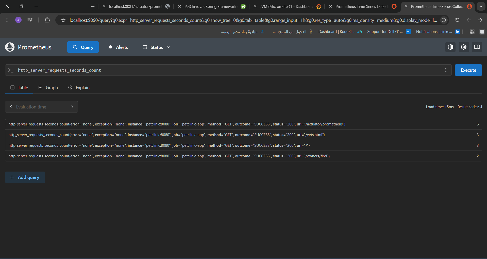

---

# 🐾 Spring PetClinic with Postgres, Prometheus & Grafana

This project demonstrates running the **Spring PetClinic** application with a **Postgres database**, monitored by **Prometheus** and **Grafana**, all orchestrated using **Docker Compose**.

---

## ✅ Prerequisites

Before running, make sure you have:

* **Docker** 🐳
* **Docker Compose**

---

## 📚 Table of Contents

1. [Overview](#-overview)
2. [Architecture](#-architecture)
3. [Services](#-services)
4. [Accessing the Apps](#-accessing-the-apps)
5. [Grafana Setup](#-grafana-setup)
6. [Screenshots](#-screenshots)
7. [Summary](#-summary)

---

## 🔎 Overview

* **PetClinic** → Sample Spring Boot app connected to Postgres, with Actuator + Prometheus metrics enabled.
* **Postgres** → Database backend for PetClinic.
* **Prometheus** → Scrapes PetClinic metrics exposed at `/actuator/prometheus`.
* **Grafana** → Visualizes metrics and provides JVM + HTTP monitoring dashboards.

---

## 🏗️ Architecture



---

## 🐳 Docker Compose Services

### 1. 🟢 PetClinic (Spring Boot App)

* Runs the **Spring PetClinic** app.
* Exposed on [http://localhost:8081](http://localhost:8081).
* Uses **Postgres** as its database.
* Exposes **Actuator + Prometheus metrics** for monitoring.

---

### 2. 🟦 Postgres (Database)

* Provides a **PostgreSQL database** for the PetClinic app.
* Credentials:

  * Username: `petclinic`
  * Password: `petclinic`
  * Database: `petclinic`
* Exposed locally on port **5432**.

---

### 3. 📊 Prometheus (Monitoring)

* Collects metrics from **PetClinic** (`/actuator/prometheus`).
* Uses a config file `prometheus.yml` to define scrape targets.
* Accessible at [http://localhost:9090](http://localhost:9090).

---

### 4. 📈 Grafana (Dashboards)

* Provides visualization for metrics collected by Prometheus.
* Default login:

  * Username: `admin`
  * Password: `admin`
* Accessible at [http://localhost:3000](http://localhost:3000).

---

## ⚡ How Everything Connects

* **PetClinic** ↔️ uses **Postgres** as its DB.
* **Prometheus** ↔️ scrapes metrics from **PetClinic**.
* **Grafana** ↔️ connects to **Prometheus** to visualize metrics.

---

## ⚙️ Services

| Service        | Port | Description                               |
| -------------- | ---- | ----------------------------------------- |
| **PetClinic**  | 8081 | Spring Boot app exposing Actuator metrics |
| **Postgres**   | 5432 | Database for PetClinic                    |
| **Prometheus** | 9090 | Scrapes metrics from PetClinic            |
| **Grafana**    | 3000 | Visualizes metrics via dashboards         |

---

## 🚀 Running the Stack

Start everything:

```bash
docker-compose up -d
```

Access the apps:

* PetClinic → [http://localhost:8081](http://localhost:8081)
* Prometheus → [http://localhost:9090](http://localhost:9090)
* Grafana → [http://localhost:3000](http://localhost:3000)

---

## 📈 Grafana Setup

1. Open [http://localhost:3000](http://localhost:3000)
   Login → `admin / admin`

2. Add **Prometheus** as a Data Source:

   * URL → `http://prometheus:9090`

3. Import a JVM Dashboard:

   * Go to `Dashboards → Import`
   * Use Dashboard ID: **4701** (JVM Micrometer) from Grafana.com

4. Start monitoring live metrics 🚀

---

## 📸 Screenshots

### 🐶 PetClinic



### 📊 Grafana Dashboards





### ⚙️ Actuator Metrics



### 🎯 Prometheus Target



### 🔍 Prometheus Query



---

## ✅ Summary

This setup includes:

* **PetClinic** app (with Postgres backend).
* **Prometheus** scraping metrics from `/actuator/prometheus`.
* **Grafana** dashboards to visualize application & JVM metrics.

